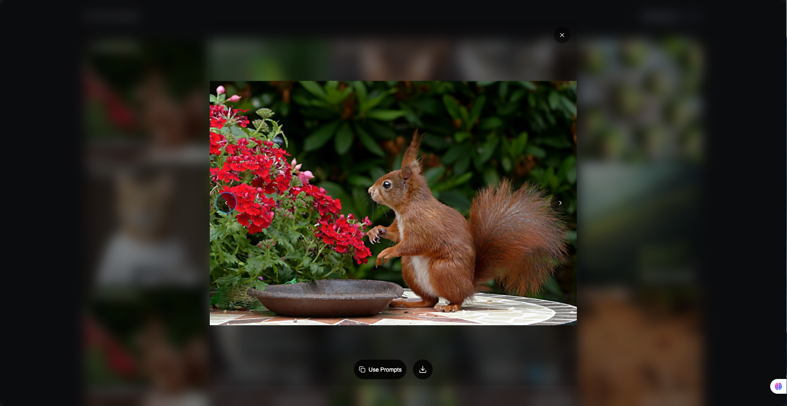

# pet-tee-generator

A pet image generator application built with TypeScript, Vite, React, DexieJS, and Shadcn UI. The project follows best practices for accessibility, testing, and scalable component structure.

**Live Demo:** [https://pet-tee.netlify.app/](https://pet-tee.netlify.app/)


_Example generated pet image 1_


_Example generated pet image 2_


_Example generated pet image 3_

## Feature List

- Smart Box for generating pet images
- History of generated images
- Quick 'Use Prompt' button
- Dark Mode support
- Reset Images functionality

## Installation

1. **Clone the repository:**
   ```sh
   git clone git@github.com:dreamid27/take-home-pet-tee.git
   cd take-home-pet-tee
   ```
2. **Install dependencies:**
   ```sh
   npm install
   # or
   yarn install
   ```

## Running the App

Before running the app, copy the example environment file and fill in the required variables:

```sh
cp .env.example .env
# Open .env and fill in the required variables (e.g., VITE_REPLICATE_API_TOKEN)
```

- **Development mode:**

  ```sh
  npm run dev
  # or
  yarn dev
  ```

  The app will be available at [http://localhost:5173](http://localhost:5173) by default.

- **Production build:**

  ```sh
  npm run build
  # or
  yarn build
  ```

- **Preview production build:**
  ```sh
  npm run preview
  # or
  yarn preview
  ```

## Testing

- **Run all tests:**
  ```sh
  npm test
  # or
  yarn test
  ```
  Uses [Vitest](https://vitest.dev/) and [Testing Library](https://testing-library.com/).

## Tech Stack

- **Vite** – Fast build tool and dev server
- **React** – UI library
- **DexieJS** – Local Database (IndexedDB)
- **TypeScript** – Static typing
- **TailwindCSS** – Utility-first CSS framework
- **Shadcn UI** – Accessible, customizable UI components
- **Vitest** – Blazing fast unit testing
- **Testing Library** – For reliable component tests

## Folder Structure

```
src/
  components/      # UI and block components
    blocks/        # Feature-specific blocks (e.g., image-card, smart-bar)
    ui/            # Reusable UI primitives (e.g., button, dialog)
  database/        # Local database logic (Dexie)
  hooks/           # Custom React hooks
  pages/           # Main app pages
  assets/          # Static assets
  lib/             # Utilities
```

## Accessibility & Best Practices

- All components follow accessibility best practices (ARIA, keyboard navigation, etc.).
- Uses early returns, descriptive naming, and DRY principles throughout the codebase.
